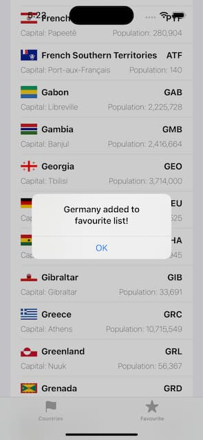
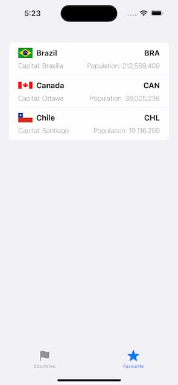

# My Favourite Countries
A simple iOS app using SwiftUI and Core Data to show a list of all countries in the world with basic information. Users can add countries to favourite list. 

### App Demo

Countries can be added by clicking the cell

Favourite country can be also removed by clicking the cell